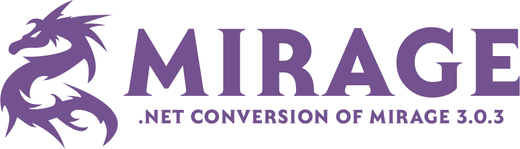

<div align="center">
    


This is a full conversion of the Mirage 3.0.3 game engine from VB6 to C#.

</div>

## Features

- Account management
- Character creation
- Basic combat system
- NPC's
- items & Spells

## Running the Server

### Prerequisites
- Docker and Docker Compose installed on your system
- .NET 9.0 SDK or later

### Steps to Run

1. First, start the required services using Docker Compose:
   ```bash
   docker-compose up -d
   ```

2. Once the services are up and running, you can start the server:
   ```bash
   cd src/Mirage.Server
   dotnet run
   ```

The server will initialize and be ready to accept client connections. 

Make sure the Docker services are running before starting the server, as it depends on them for proper functionality.

### Stopping the Server

1. To stop the server, press `Ctrl+C` in the terminal where it's running.

2. To stop the Docker services when you're done:
   ```bash
   docker-compose down
   ```
